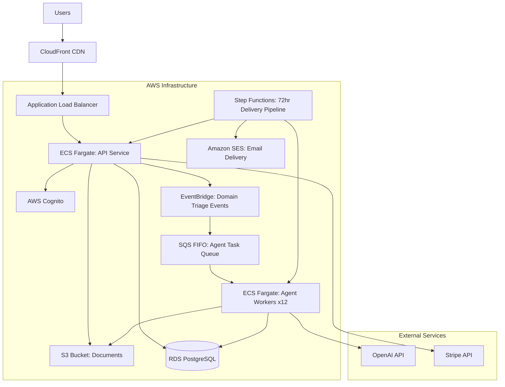
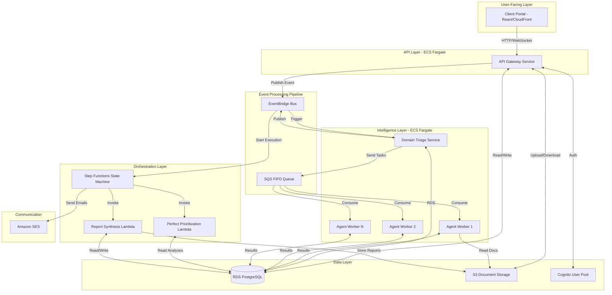
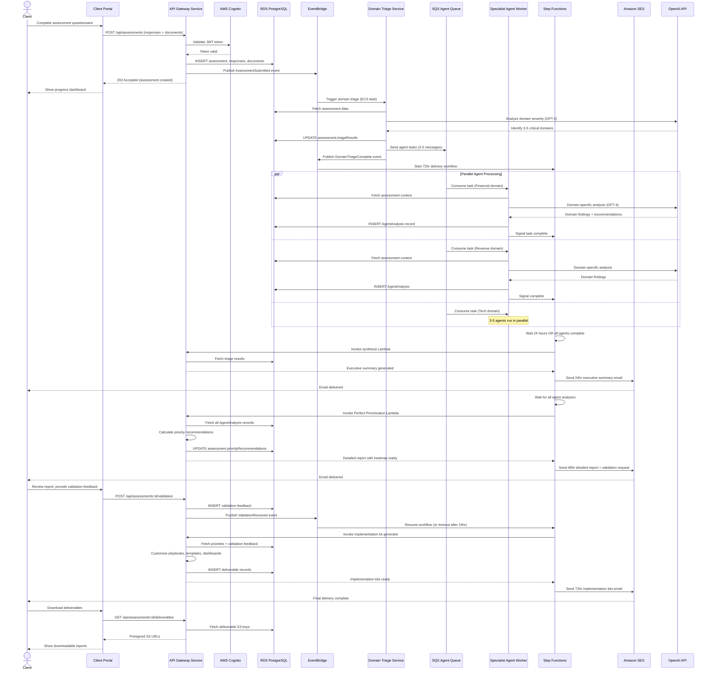
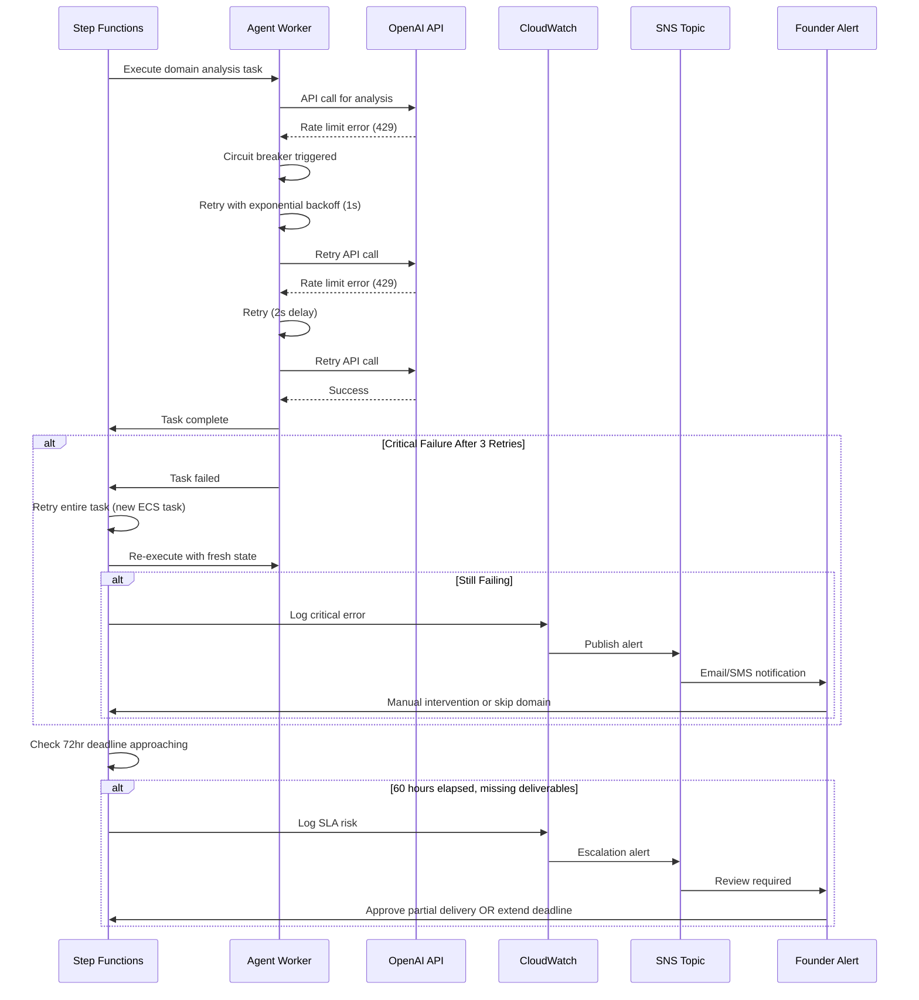

# ScaleMap Architecture Document

**Date:** 2025-09-23
**Version:** 2.0

## Introduction

This document outlines the overall project architecture for **ScaleMap**, including backend systems, shared services, and non-UI specific concerns. Its primary goal is to serve as the guiding architectural blueprint for AI-driven development, ensuring consistency and adherence to chosen patterns and technologies.

**Relationship to Frontend Architecture:**
The project includes a significant React-based user interface. This architecture document focuses on backend infrastructure, AI agent orchestration, and deployment. Frontend-specific design will reference the core technology stack choices documented herein.

### Starter Template or Existing Project

**Current Foundation:**
- **Express + React Monorepo** - Already established in `/server` and `/client` directories
- **Vite** for frontend bundling (package.json:143)
- **TypeScript 5.6.3** throughout
- **Drizzle ORM** for database operations
- **AWS SDK v3** already integrated (@aws-sdk/client-s3, cognito packages present)

**Key Observation:** This is NOT a greenfield project. You have a functional Express/React application that needs AWS infrastructure optimization, not a complete rewrite.

### Change Log

| Date | Version | Description | Author |
|------|---------|-------------|---------|
| 2025-09-23 | 2.0 | Revised AWS Architecture - ECS Fargate Migration | Winston (Architect) |
| 2025-09-22 | 1.0 | Initial AWS Migration Architecture | Winston (Architect) |

---

## High Level Architecture

### Technical Summary

ScaleMap employs an **event-driven microservices architecture** built on AWS ECS Fargate for containerized workload orchestration. The system leverages **EventBridge for domain triage events**, **SQS FIFO queues for agent task distribution**, and **Step Functions for the 72-hour staged delivery state machine**. Core technology choices include TypeScript/Node.js for the API layer, containerized domain agent workers, and AWS-native services (RDS PostgreSQL, S3, Cognito) for data persistence, storage, and authentication. This architecture directly supports the PRD's Perfect Prioritization algorithm by enabling intelligent agent activation (3-5 specialists vs. all 12) while maintaining the 72-hour delivery SLA through parallel agent processing and automated workflow orchestration.

### High Level Overview

**Architectural Style:** Event-Driven Microservices with Serverless Orchestration

**Repository Structure:** Monorepo (existing structure maintained)
- `/server` - Express API and agent orchestration logic
- `/client` - React frontend application
- `/shared` - Common types, schemas, and utilities

**Service Architecture:**
1. **API Gateway Layer** - Express API hosted on ECS Fargate (user-facing HTTP endpoints)
2. **Agent Orchestration Service** - Master coordinator for multi-agent workflows
3. **Domain Agent Workers** - 12 specialist agents deployed as Fargate tasks (conditionally activated)
4. **Event Processing Pipeline** - EventBridge → SQS → Fargate task execution
5. **State Machine Orchestration** - Step Functions managing 24/48/72-hour delivery stages

**Primary User Flow:**
1. User completes assessment questionnaire → API stores data in RDS
2. Assessment submission triggers EventBridge event → Domain Triage Agent activated
3. Triage identifies 3-5 critical domains → SQS messages sent to specialist agent queue
4. Specialist agents (Fargate tasks) process in parallel → results stored in RDS
5. Step Functions orchestrates staged delivery: 24hr summary → 48hr detailed report → 72hr implementation kits
6. Results delivered via client portal with agent personality attribution

**Key Architectural Decisions:**
- **ECS Fargate over Lambda:** Supports long-running agent processes (15min+ analysis per domain) without timeout constraints
- **EventBridge + SQS:** Decouples triage from execution, enables reliable agent task distribution
- **Step Functions:** Manages complex 72-hour workflow state with automatic retries and error handling
- **Container-based agents:** Preserves existing Express/TypeScript codebase, minimal refactoring required

### High Level Project Diagram



### Architectural and Design Patterns

- **Event-Driven Architecture:** Using AWS EventBridge for domain triage event distribution - _Rationale:_ Decouples assessment intake from agent processing, enables scalable concurrent analysis across 10+ assessments simultaneously

- **Saga Pattern with Step Functions:** Managing 72-hour delivery workflow as distributed transaction - _Rationale:_ Handles complex multi-stage delivery (24/48/72hr) with automatic compensation and retry logic for failed stages

- **Worker Queue Pattern:** SQS FIFO queues feeding ECS Fargate agent tasks - _Rationale:_ Ensures ordered processing of domain analysis tasks, supports backpressure management during high load

- **Repository Pattern:** Abstract data access through Drizzle ORM repositories - _Rationale:_ Already established in codebase, maintains testability and database migration flexibility

- **Circuit Breaker Pattern:** For OpenAI API calls within agents - _Rationale:_ Protects against API rate limits and outages, prevents cascading failures across agent pool

- **Container-based Microservices:** ECS Fargate for API and agent workers - _Rationale:_ Preserves existing Node.js/Express codebase, eliminates EC2 management overhead, supports independent scaling of API vs. agent workloads

---

## Tech Stack

### Cloud Infrastructure
- **Provider:** AWS (Amazon Web Services)
- **Key Services:** ECS Fargate, EventBridge, SQS, Step Functions, RDS PostgreSQL, S3, Cognito, CloudWatch, Application Load Balancer
- **Deployment Regions:** eu-west-1 (primary), with multi-region expansion capability

### Technology Stack Table

| Category | Technology | Version | Purpose | Rationale |
|----------|------------|---------|---------|-----------|
| **Language** | TypeScript | 5.6.3 | Primary development language | Already in use, strong typing for complex agent orchestration |
| **Runtime** | Node.js | 20.x LTS | JavaScript runtime | Current LTS, stable for production workloads |
| **Backend Framework** | Express | 4.21.2 | API server framework | Already implemented, minimal migration changes needed |
| **Frontend Framework** | React | 18.3.1 | UI library | Existing client implementation |
| **Frontend Build** | Vite | 5.4.20 | Frontend bundler | Fast dev experience, production optimized |
| **ORM** | Drizzle | 0.39.1 | Database query builder | Already integrated, type-safe PostgreSQL access |
| **Database** | AWS RDS PostgreSQL | 16.x | Primary data store | Managed service, Free Tier eligible (db.t3.micro) |
| **File Storage** | AWS S3 | - | Document/file storage | Already integrated via @aws-sdk/client-s3 |
| **Authentication** | AWS Cognito | - | User auth & management | Already integrated, 50K MAU free tier |
| **Container Orchestration** | AWS ECS Fargate | - | Serverless container platform | No EC2 management, pay-per-use pricing |
| **Event Bus** | AWS EventBridge | - | Domain triage event routing | Decouples assessment from agent activation |
| **Message Queue** | AWS SQS FIFO | - | Agent task distribution | Ordered processing, exactly-once delivery |
| **Workflow Orchestration** | AWS Step Functions | - | 72hr delivery state machine | Visual workflows, built-in retry/error handling |
| **AI/ML** | OpenAI API | GPT-4 | Agent intelligence layer | Perfect Prioritization algorithm, domain analysis |
| **Payment Processing** | Stripe | 18.5.0 | Revenue management | Already integrated in codebase |
| **Email Delivery** | Amazon SES | - | Staged deliverable emails | Cost-effective, high deliverability |
| **Monitoring** | AWS CloudWatch | - | Logs, metrics, alarms | Native AWS integration, centralized observability |
| **CDN** | AWS CloudFront | - | Static asset delivery | Low latency, Free Tier 1TB/month |
| **Load Balancer** | AWS ALB | - | Traffic distribution | HTTP/HTTPS routing, health checks |
| **Testing Framework** | Jest | 30.1.3 | Unit/integration tests | Already configured in package.json |
| **Container Runtime** | Docker | 24.x | Container packaging | ECS Fargate requirement |
| **IaC** | AWS CDK | 2.x (TypeScript) | Infrastructure as code | Type-safe infrastructure, reusable constructs |

### AWS Free Tier & Cost Analysis

**Services Covered by Free Tier (12 months):**
- **RDS PostgreSQL:** 750 hours/month db.t3.micro, 20GB storage → **$0/month** ✅
- **S3:** 5GB storage, 20K GET/2K PUT requests → **$0-5/month** (overage minimal)
- **Cognito:** 50,000 MAU permanently free → **$0/month** ✅
- **CloudFront:** 1TB data transfer/month → **$0/month** ✅
- **SES:** 62,000 emails/month (via EC2/Fargate) → **$0/month** ✅

**Services Using $120 Credits:**
- **ECS Fargate:** ~$25-35/month (API service + agent workers)
  - API service: 1 vCPU, 2GB RAM running 24/7 = ~$15/month
  - Agent workers: 0.5 vCPU, 1GB RAM on-demand = ~$10-20/month (based on assessment volume)
- **EventBridge:** $1/million events → ~$1/month
- **SQS:** $0.40/million requests → ~$1/month
- **Step Functions:** $25/1K state transitions → ~$3-5/month
- **ALB:** ~$16/month (not free tier eligible)

**Total Monthly Cost Estimate:**
- **Months 1-12:** $45-60/month (Free Tier + Credits) → **Credits last 2+ months** ✓
- **After Free Tier:** $65-80/month (sustainable production cost)

**Cost Optimization Notes:**
- Agent workers scale to zero when idle (pay only for active assessments)
- Can reduce to 1 Fargate task for MVP, scale up as revenue grows
- Free Tier provides 12-month runway for RDS, S3, Cognito

---

## Data Models

### User
**Purpose:** Represents scaling company founders/leaders who purchase and receive operational assessments

**Key Attributes:**
- `id`: UUID - Primary identifier
- `email`: String - Login credential and communication channel
- `cognitoUserId`: String - AWS Cognito user pool reference
- `companyName`: String - Client organization name
- `industry`: Enum(regulated, non_regulated) - Determines assessment domain branching
- `companySize`: String - Employee count for context
- `createdAt`: Timestamp - Account creation date

**Relationships:**
- One-to-Many with Assessment (user can have multiple assessments)
- One-to-Many with Payment (billing history)

---

### Assessment
**Purpose:** Core entity representing a single operational diagnostic engagement with 72-hour delivery lifecycle

**Key Attributes:**
- `id`: UUID - Primary identifier
- `userId`: UUID - Foreign key to User
- `status`: Enum(in_progress, triage_complete, analysis_complete, delivered) - Workflow state
- `submittedAt`: Timestamp - When user completed questionnaire
- `triageCompletedAt`: Timestamp - Domain prioritization finished (24hr mark)
- `analysisCompletedAt`: Timestamp - Detailed report ready (48hr mark)
- `deliveredAt`: Timestamp - Implementation kits sent (72hr mark)
- `triageResults`: JSON - Which 3-5 domains identified as critical
- `priorityRecommendations`: JSON - Perfect Prioritization algorithm output

**Relationships:**
- Many-to-One with User
- One-to-Many with AssessmentResponse (questionnaire answers)
- One-to-Many with Document (uploaded supporting files)
- One-to-Many with AgentAnalysis (domain expert findings)
- One-to-Many with Deliverable (staged reports and kits)

---

### AssessmentResponse
**Purpose:** Stores user answers to 12-domain diagnostic questionnaire with industry-specific branching

**Key Attributes:**
- `id`: UUID - Primary identifier
- `assessmentId`: UUID - Foreign key to Assessment
- `questionId`: UUID - Reference to Question definition
- `domainId`: Enum(strategic_alignment, financial_mgmt, revenue_engine, operational_excellence, people_org, tech_data, customer_experience, supply_chain, risk_compliance, partnerships, customer_success, change_mgmt) - One of 12 domains
- `responseValue`: JSON - Answer data (text, numeric, multiple choice)
- `confidenceScore`: Integer(1-5) - User's certainty about their answer

**Relationships:**
- Many-to-One with Assessment
- Many-to-One with Question (reference data)

---

### Document
**Purpose:** User-uploaded supporting materials (org charts, financial reports, process docs) for deeper analysis

**Key Attributes:**
- `id`: UUID - Primary identifier
- `assessmentId`: UUID - Foreign key to Assessment
- `fileName`: String - Original upload name
- `s3Key`: String - S3 object path
- `fileType`: String - MIME type
- `fileSize`: Integer - Bytes for storage tracking
- `domainTags`: Array[Enum] - Which domains this document supports
- `uploadedAt`: Timestamp - Upload timestamp

**Relationships:**
- Many-to-One with Assessment
- Referenced by AgentAnalysis (agents consume documents)

---

### AgentAnalysis
**Purpose:** Results from individual domain specialist agents (3-5 activated per assessment based on triage)

**Key Attributes:**
- `id`: UUID - Primary identifier
- `assessmentId`: UUID - Foreign key to Assessment
- `agentId`: Enum(12 domain agent types) - Which specialist performed analysis
- `agentPersona`: String - Agent name for UI attribution (e.g., "Financial Expert - Marcus")
- `domainFindings`: JSON - Structured analysis results
- `healthScore`: Integer(0-100) - Domain operational health
- `recommendations`: JSON - Specific improvement actions
- `confidenceLevel`: Integer(1-5) - Agent's certainty about findings
- `processingTimeMs`: Integer - Performance tracking
- `completedAt`: Timestamp - Analysis finish time

**Relationships:**
- Many-to-One with Assessment
- Referenced in Deliverable synthesis

---

### Deliverable
**Purpose:** Staged outputs delivered at 24hr (summary), 48hr (detailed report), 72hr (implementation kits)

**Key Attributes:**
- `id`: UUID - Primary identifier
- `assessmentId`: UUID - Foreign key to Assessment
- `deliveryStage`: Enum(executive_summary, detailed_report, implementation_kit) - Which stage
- `s3Key`: String - Generated document location
- `deliveredAt`: Timestamp - Email send timestamp
- `downloadCount`: Integer - Client engagement tracking
- `clientFeedback`: JSON - Validation responses (48hr stage only)

**Relationships:**
- Many-to-One with Assessment
- Contains aggregated AgentAnalysis data

---

### Payment
**Purpose:** Stripe payment tracking for £5-8K assessment packages

**Key Attributes:**
- `id`: UUID - Primary identifier
- `userId`: UUID - Foreign key to User
- `assessmentId`: UUID - Optional link to purchased assessment
- `stripePaymentIntentId`: String - Stripe reference
- `amount`: Integer - Pence/cents (e.g., 500000 = £5000)
- `currency`: String - GBP default
- `status`: Enum(pending, succeeded, failed, refunded) - Payment state
- `paidAt`: Timestamp - Successful payment timestamp

**Relationships:**
- Many-to-One with User
- One-to-One with Assessment (after payment confirmation triggers assessment creation)

---

## Components

### API Gateway Service
**Responsibility:** User-facing HTTP API handling authentication, assessment intake, file uploads, and client portal access. Runs as always-on ECS Fargate service.

**Key Interfaces:**
- `POST /api/auth/register` - User registration via Cognito
- `POST /api/auth/login` - Authentication with JWT token issuance
- `POST /api/assessments` - Assessment creation and questionnaire submission
- `POST /api/assessments/:id/documents` - S3 presigned URL generation for file uploads
- `GET /api/assessments/:id/deliverables` - Fetch staged reports (24/48/72hr)
- `POST /api/payments` - Stripe payment intent creation
- WebSocket `/ws/assessment-status` - Real-time progress updates to client UI

**Dependencies:**
- AWS Cognito (authentication)
- RDS PostgreSQL (data persistence via Drizzle ORM)
- S3 (document storage)
- EventBridge (publishes assessment submission events)
- Stripe API (payment processing)

**Technology Stack:**
- Express 4.21.2 on Node.js 20.x
- AWS SDK v3 for Cognito/S3/EventBridge
- Deployed as ECS Fargate task (1 vCPU, 2GB RAM, always running)

---

### Domain Triage Service
**Responsibility:** Intelligent domain prioritization engine that analyzes complete assessment data to identify 3-5 critical operational domains requiring deep specialist analysis (vs. all 12 domains).

**Key Interfaces:**
- Triggered by EventBridge rule on `AssessmentSubmitted` event
- `analyze(assessmentId)` - Main entry point consuming assessment responses + documents
- Publishes `DomainTriageComplete` event with activated domain list to EventBridge
- Writes triage results to `assessment.triageResults` in RDS

**Dependencies:**
- OpenAI API (GPT-4 for domain severity scoring and cross-domain impact analysis)
- RDS PostgreSQL (reads assessment data, writes triage results)
- EventBridge (receives submission events, publishes triage completion)
- SQS (sends agent activation messages to specialist queue)

**Technology Stack:**
- Deployed as ECS Fargate task (0.5 vCPU, 1GB RAM, event-triggered)
- OpenAI SDK for LLM calls with structured output
- Executes within 2-hour SLA for 24hr executive summary delivery

---

### Specialist Agent Workers (x12)
**Responsibility:** Domain expert agents that perform deep operational analysis when activated by triage. Only 3-5 agents run per assessment based on triage results, reducing API costs 50-60%.

**Key Interfaces:**
- Consumes messages from SQS FIFO `agent-tasks` queue
- `analyzeDomain(assessmentId, domainId, agentPersona)` - Core analysis method
- Writes `AgentAnalysis` records to RDS with domain findings, health scores, recommendations
- Signals completion to Step Functions state machine

**Dependencies:**
- SQS FIFO queue (receives agent activation tasks)
- OpenAI API (domain-specific expertise via specialized prompts)
- RDS PostgreSQL (reads assessment context, writes analysis results)
- S3 (reads uploaded documents for evidence-based analysis)
- Step Functions (reports task completion for orchestration)

**Technology Stack:**
- 12 agent types with specialized personas: Strategic Alignment, Financial, Revenue, Operations, People, Tech/Data, Customer Experience, Supply Chain, Risk/Compliance, Partnerships, Customer Success, Change Management
- Deployed as on-demand ECS Fargate tasks (0.5 vCPU, 1GB RAM per agent)
- Auto-scaling: 0 tasks when idle, up to 10 concurrent agents during peak load
- Average runtime: 10-15 minutes per domain analysis

---

### Master Orchestrator (Step Functions)
**Responsibility:** Coordinates 72-hour staged delivery workflow: 24hr executive summary → 48hr detailed report with validation → 72hr implementation kits based on client feedback.

**Key Interfaces:**
- Initiated by `DomainTriageComplete` EventBridge event
- **Stage 1 (24hr):** Wait for triage → generate executive summary → send via SES
- **Stage 2 (48hr):** Wait for all agent analyses → synthesize detailed report with heatmaps → send with validation request
- **Stage 3 (72hr):** Collect client validation feedback → customize implementation kits → final delivery
- Error handling: Retry failed agent tasks, alert founder if critical delays occur

**Dependencies:**
- Step Functions Express Workflows (24hr timeout per execution)
- Lambda functions for report synthesis (aggregates agent findings)
- SES (email delivery of staged reports)
- RDS (reads analysis data, writes deliverable records)
- EventBridge (receives orchestration triggers)

**Technology Stack:**
- AWS Step Functions state machine (visual workflow definition)
- Lambda functions (Node.js 20.x) for report generation logic
- Perfect Prioritization Algorithm implemented in synthesis Lambda
- Automated retry with exponential backoff for transient failures

---

### Client Portal Service (React App)
**Responsibility:** User interface for assessment completion, progress tracking, agent personality visualization, deliverable access, and implementation milestone tracking.

**Key Interfaces:**
- `/assessment` - 12-domain questionnaire with progress indicators
- `/dashboard` - Real-time agent activity cards showing activated specialists (3-5 of 12)
- `/results/:assessmentId` - Interactive heatmaps, priority recommendations, deliverable downloads
- `/validation/:assessmentId` - 48hr feedback mechanism for priority confirmation

**Dependencies:**
- API Gateway Service (all backend communication)
- CloudFront CDN (static asset delivery)
- WebSocket connection for real-time status updates

**Technology Stack:**
- React 18.3.1 with TypeScript
- Vite 5.4.20 for build tooling
- Deployed as static files to S3, served via CloudFront
- Radix UI components for accessibility (WCAG AA compliance)

---

### Perfect Prioritization Engine
**Responsibility:** Meta-analysis algorithm that synthesizes findings from activated domain agents to identify 2-3 operational changes unlocking 80% of growth potential.

**Key Interfaces:**
- `calculatePriority(agentAnalyses[], industryContext)` - Main algorithm
- Outputs ranked recommendations with growth impact scores, implementation complexity, cross-domain dependencies
- Stored in `assessment.priorityRecommendations` JSON field

**Dependencies:**
- Specialist Agent Workers (consumes all domain analysis results)
- Industry-specific weighting rules (regulated vs. non-regulated)
- Historical outcome data (for algorithm validation and improvement)

**Technology Stack:**
- Implemented as Lambda function (TypeScript)
- Invoked by Step Functions during Stage 2 synthesis
- Uses weighted scoring: 40% growth impact, 30% implementation feasibility, 30% cross-domain leverage

---

### Component Diagrams



---

## External APIs

### OpenAI API
- **Purpose:** Powers all AI agent intelligence for domain triage, specialist analysis, and Perfect Prioritization algorithm
- **Documentation:** https://platform.openai.com/docs/api-reference
- **Base URL(s):** https://api.openai.com/v1
- **Authentication:** Bearer token (API key stored in AWS Secrets Manager)
- **Rate Limits:**
  - GPT-4: 10,000 TPM (tokens per minute), 500 RPM (requests per minute) - Tier 1 default
  - Cost: $0.03/1K input tokens, $0.06/1K output tokens
  - Budget tracking via CloudWatch metrics

**Key Endpoints Used:**
- `POST /chat/completions` - All agent intelligence (triage, domain analysis, synthesis)
- Uses structured output with JSON schema for reliable data extraction
- Function calling for domain-specific analysis workflows

**Integration Notes:**
- Circuit breaker pattern with 3 retries for transient failures
- Exponential backoff: 1s, 2s, 4s delays
- Token usage logging per assessment for cost optimization
- Agent-specific system prompts stored in RDS `agent_prompts` table
- Estimated usage: 50-60K tokens per assessment (3-5 agents active vs. 120K for all 12)

---

### Stripe API
- **Purpose:** Payment processing for £5-8K assessment packages with secure checkout and billing management
- **Documentation:** https://stripe.com/docs/api
- **Base URL(s):** https://api.stripe.com/v1
- **Authentication:** Secret key (stored in AWS Secrets Manager)
- **Rate Limits:**
  - 100 requests/second default
  - Payment intents: No specific limit, use idempotency keys

**Key Endpoints Used:**
- `POST /v1/payment_intents` - Create payment intent for assessment purchase
- `GET /v1/payment_intents/:id` - Verify payment status
- `POST /v1/webhooks` - Receive payment confirmation events (handled by API Gateway Service)
- `POST /v1/refunds` - Process refunds if assessment fails SLA

**Integration Notes:**
- Webhook signature verification using Stripe SDK
- Idempotency keys for all payment creation requests (prevent double charges)
- Metadata includes `assessmentId` for linking payment to workflow
- Webhook handler initiates assessment creation via EventBridge after `payment_intent.succeeded`
- Test mode keys for staging, live keys in production only

---

### Amazon SES (Internal AWS Service)
- **Purpose:** Delivery of staged assessment reports (24hr summary, 48hr detailed report, 72hr implementation kits) with high deliverability
- **Documentation:** https://docs.aws.amazon.com/ses/latest/dg/
- **Base URL(s):** AWS SDK integration (no direct HTTP calls)
- **Authentication:** IAM role attached to Step Functions execution role
- **Rate Limits:**
  - Sandbox: 200 emails/day (verify production access immediately)
  - Production: 50,000 emails/day default, higher limits on request
  - 14 emails/second sending rate

**Key Endpoints Used:**
- `SendEmail` - Staged deliverable emails with PDF attachments (via S3 presigned URLs)
- `SendTemplatedEmail` - Using SES email templates for consistent branding
- Configuration sets for tracking open/bounce rates

**Integration Notes:**
- Move out of SES sandbox immediately (verify domain, request production access)
- Use SES configuration sets for delivery analytics
- Email templates stored in SES for 24hr/48hr/72hr stages
- Attachment strategy: Embed S3 presigned URLs (7-day expiry) rather than inline attachments
- Bounce handling: SNS topic → Lambda → mark user email as invalid in RDS

---

## Core Workflows

### Workflow 1: Complete Assessment Lifecycle (72-Hour Delivery)



### Workflow 2: Error Handling & SLA Recovery



---

## Database Schema

```sql
-- Users table (Cognito-backed authentication)
CREATE TABLE users (
    id UUID PRIMARY KEY DEFAULT gen_random_uuid(),
    email VARCHAR(255) UNIQUE NOT NULL,
    cognito_user_id VARCHAR(255) UNIQUE NOT NULL,
    company_name VARCHAR(255) NOT NULL,
    industry VARCHAR(50) CHECK (industry IN ('regulated', 'non_regulated')),
    company_size VARCHAR(50),
    created_at TIMESTAMP WITH TIME ZONE DEFAULT CURRENT_TIMESTAMP,
    updated_at TIMESTAMP WITH TIME ZONE DEFAULT CURRENT_TIMESTAMP
);

CREATE INDEX idx_users_email ON users(email);
CREATE INDEX idx_users_cognito ON users(cognito_user_id);

-- Assessments table (core engagement lifecycle)
CREATE TABLE assessments (
    id UUID PRIMARY KEY DEFAULT gen_random_uuid(),
    user_id UUID NOT NULL REFERENCES users(id) ON DELETE CASCADE,
    status VARCHAR(50) DEFAULT 'in_progress' CHECK (status IN ('in_progress', 'triage_complete', 'analysis_complete', 'delivered')),
    submitted_at TIMESTAMP WITH TIME ZONE,
    triage_completed_at TIMESTAMP WITH TIME ZONE,
    analysis_completed_at TIMESTAMP WITH TIME ZONE,
    delivered_at TIMESTAMP WITH TIME ZONE,
    triage_results JSONB, -- {activatedDomains: ['financial', 'revenue', 'tech'], reasoning: '...'}
    priority_recommendations JSONB, -- Perfect Prioritization output
    created_at TIMESTAMP WITH TIME ZONE DEFAULT CURRENT_TIMESTAMP,
    updated_at TIMESTAMP WITH TIME ZONE DEFAULT CURRENT_TIMESTAMP
);

CREATE INDEX idx_assessments_user ON assessments(user_id);
CREATE INDEX idx_assessments_status ON assessments(status);
CREATE INDEX idx_assessments_submitted ON assessments(submitted_at);

-- Assessment responses (questionnaire answers)
CREATE TABLE assessment_responses (
    id UUID PRIMARY KEY DEFAULT gen_random_uuid(),
    assessment_id UUID NOT NULL REFERENCES assessments(id) ON DELETE CASCADE,
    question_id UUID NOT NULL,
    domain_id VARCHAR(50) NOT NULL CHECK (domain_id IN (
        'strategic_alignment', 'financial_mgmt', 'revenue_engine', 'operational_excellence',
        'people_org', 'tech_data', 'customer_experience', 'supply_chain',
        'risk_compliance', 'partnerships', 'customer_success', 'change_mgmt'
    )),
    response_value JSONB NOT NULL, -- Flexible for text, numeric, multiple choice
    confidence_score INTEGER CHECK (confidence_score BETWEEN 1 AND 5),
    created_at TIMESTAMP WITH TIME ZONE DEFAULT CURRENT_TIMESTAMP
);

CREATE INDEX idx_responses_assessment ON assessment_responses(assessment_id);
CREATE INDEX idx_responses_domain ON assessment_responses(domain_id);

-- Documents (uploaded supporting materials)
CREATE TABLE documents (
    id UUID PRIMARY KEY DEFAULT gen_random_uuid(),
    assessment_id UUID NOT NULL REFERENCES assessments(id) ON DELETE CASCADE,
    file_name VARCHAR(500) NOT NULL,
    s3_key VARCHAR(1000) NOT NULL UNIQUE,
    file_type VARCHAR(100),
    file_size_bytes BIGINT,
    domain_tags TEXT[], -- Array of domain IDs this doc supports
    uploaded_at TIMESTAMP WITH TIME ZONE DEFAULT CURRENT_TIMESTAMP
);

CREATE INDEX idx_documents_assessment ON documents(assessment_id);
CREATE INDEX idx_documents_s3_key ON documents(s3_key);

-- Agent analyses (specialist domain findings)
CREATE TABLE agent_analyses (
    id UUID PRIMARY KEY DEFAULT gen_random_uuid(),
    assessment_id UUID NOT NULL REFERENCES assessments(id) ON DELETE CASCADE,
    agent_id VARCHAR(50) NOT NULL, -- Same as domain_id enum
    agent_persona VARCHAR(100) NOT NULL, -- "Financial Expert - Marcus"
    domain_findings JSONB NOT NULL,
    health_score INTEGER CHECK (health_score BETWEEN 0 AND 100),
    recommendations JSONB NOT NULL,
    confidence_level INTEGER CHECK (confidence_level BETWEEN 1 AND 5),
    processing_time_ms INTEGER,
    completed_at TIMESTAMP WITH TIME ZONE DEFAULT CURRENT_TIMESTAMP
);

CREATE INDEX idx_agent_analyses_assessment ON agent_analyses(assessment_id);
CREATE INDEX idx_agent_analyses_agent ON agent_analyses(agent_id);

-- Deliverables (staged outputs)
CREATE TABLE deliverables (
    id UUID PRIMARY KEY DEFAULT gen_random_uuid(),
    assessment_id UUID NOT NULL REFERENCES assessments(id) ON DELETE CASCADE,
    delivery_stage VARCHAR(50) NOT NULL CHECK (delivery_stage IN ('executive_summary', 'detailed_report', 'implementation_kit')),
    s3_key VARCHAR(1000) NOT NULL,
    delivered_at TIMESTAMP WITH TIME ZONE DEFAULT CURRENT_TIMESTAMP,
    download_count INTEGER DEFAULT 0,
    client_feedback JSONB -- Validation responses (48hr stage only)
);

CREATE INDEX idx_deliverables_assessment ON deliverables(assessment_id);
CREATE INDEX idx_deliverables_stage ON deliverables(delivery_stage);

-- Payments (Stripe integration)
CREATE TABLE payments (
    id UUID PRIMARY KEY DEFAULT gen_random_uuid(),
    user_id UUID NOT NULL REFERENCES users(id) ON DELETE CASCADE,
    assessment_id UUID REFERENCES assessments(id) ON DELETE SET NULL,
    stripe_payment_intent_id VARCHAR(255) UNIQUE NOT NULL,
    amount INTEGER NOT NULL, -- Pence/cents
    currency VARCHAR(3) DEFAULT 'GBP',
    status VARCHAR(50) DEFAULT 'pending' CHECK (status IN ('pending', 'succeeded', 'failed', 'refunded')),
    paid_at TIMESTAMP WITH TIME ZONE,
    created_at TIMESTAMP WITH TIME ZONE DEFAULT CURRENT_TIMESTAMP
);

CREATE INDEX idx_payments_user ON payments(user_id);
CREATE INDEX idx_payments_stripe ON payments(stripe_payment_intent_id);
CREATE INDEX idx_payments_status ON payments(status);

-- Agent prompts (system prompts for each specialist)
CREATE TABLE agent_prompts (
    id UUID PRIMARY KEY DEFAULT gen_random_uuid(),
    agent_id VARCHAR(50) UNIQUE NOT NULL,
    agent_name VARCHAR(100) NOT NULL,
    system_prompt TEXT NOT NULL,
    version INTEGER DEFAULT 1,
    is_active BOOLEAN DEFAULT true,
    created_at TIMESTAMP WITH TIME ZONE DEFAULT CURRENT_TIMESTAMP,
    updated_at TIMESTAMP WITH TIME ZONE DEFAULT CURRENT_TIMESTAMP
);

CREATE INDEX idx_agent_prompts_active ON agent_prompts(agent_id, is_active);

-- Performance indexes for common queries
CREATE INDEX idx_assessments_user_status ON assessments(user_id, status);
CREATE INDEX idx_agent_analyses_assessment_agent ON agent_analyses(assessment_id, agent_id);
```

**Migration Strategy:**
- Use Drizzle Kit for schema migrations: `npm run db:push`
- Existing schema in `/shared/schema.ts` should be updated to match this SQL
- RDS PostgreSQL 16.x supports all features (JSONB, arrays, check constraints)

**Performance Considerations:**
- JSONB indexes for triage_results and priority_recommendations if query performance degrades
- Partitioning on assessments table by created_at if volume exceeds 100K records
- Connection pooling via Drizzle (already configured in server/db.ts)

---

## Source Tree

```
scalemap/
├── .github/
│   └── workflows/
│       ├── ci.yml                          # Automated tests on PR
│       ├── deploy-staging.yml              # Deploy to staging on merge to main
│       └── deploy-production.yml           # Deploy to prod on release tag
│
├── client/                                  # React frontend (deployed to S3/CloudFront)
│   ├── src/
│   │   ├── components/                     # Reusable UI components (Radix UI)
│   │   │   ├── assessment/                 # Assessment questionnaire components
│   │   │   ├── dashboard/                  # Agent activity, progress tracking
│   │   │   ├── results/                    # Heatmaps, deliverables viewer
│   │   │   └── ui/                         # Shared design system components
│   │   ├── lib/
│   │   │   ├── api.ts                      # API client (fetch wrapper)
│   │   │   ├── auth.ts                     # Cognito integration
│   │   │   └── websocket.ts                # Real-time status updates
│   │   ├── pages/
│   │   │   ├── Assessment.tsx              # Main questionnaire
│   │   │   ├── Dashboard.tsx               # Agent activity view
│   │   │   ├── Results.tsx                 # Deliverables and heatmaps
│   │   │   └── Validation.tsx              # 48hr feedback form
│   │   ├── App.tsx
│   │   └── main.tsx
│   ├── index.html
│   ├── package.json
│   ├── tsconfig.json
│   └── vite.config.ts
│
├── server/                                  # Express API + Agent Workers
│   ├── src/
│   │   ├── api/                            # HTTP API layer (API Gateway Service)
│   │   │   ├── routes/
│   │   │   │   ├── auth.ts                 # Cognito login/register
│   │   │   │   ├── assessments.ts          # CRUD + submission
│   │   │   │   ├── documents.ts            # S3 upload/download
│   │   │   │   ├── payments.ts             # Stripe integration
│   │   │   │   └── deliverables.ts         # Report access
│   │   │   ├── middleware/
│   │   │   │   ├── auth.ts                 # JWT validation
│   │   │   │   ├── errorHandler.ts         # Global error handling
│   │   │   │   └── rateLimit.ts            # API rate limiting
│   │   │   └── app.ts                      # Express app setup
│   │   │
│   │   ├── agents/                         # Domain specialist agents
│   │   │   ├── triage/
│   │   │   │   ├── triageService.ts        # Domain Triage Service
│   │   │   │   └── triagePrompt.ts         # GPT-4 system prompt
│   │   │   ├── workers/
│   │   │   │   ├── agentWorker.ts          # Base agent worker class
│   │   │   │   ├── financialAgent.ts       # Financial domain specialist
│   │   │   │   ├── revenueAgent.ts         # Revenue engine specialist
│   │   │   │   └── ... (10 more agents)
│   │   │   └── orchestrator/
│   │   │       ├── agentPool.ts            # SQS consumer, task distribution
│   │   │       └── circuitBreaker.ts       # OpenAI resilience pattern
│   │   │
│   │   ├── workflows/                      # Step Functions implementations
│   │   │   ├── deliveryPipeline.ts         # 72hr state machine definition
│   │   │   ├── synthesis/
│   │   │   │   ├── prioritization.ts       # Perfect Prioritization Lambda
│   │   │   │   ├── reportGenerator.ts      # Detailed report synthesis
│   │   │   │   └── implementationKits.ts   # Kit customization logic
│   │   │   └── notifications/
│   │   │       └── emailService.ts         # SES email delivery
│   │   │
│   │   ├── services/                       # Shared services
│   │   │   ├── cognitoAuth.ts              # Authentication logic
│   │   │   ├── s3Storage.ts                # S3 operations (already exists)
│   │   │   ├── eventBridge.ts              # Event publishing
│   │   │   ├── sqsClient.ts                # SQS message handling
│   │   │   └── openaiClient.ts             # OpenAI SDK wrapper
│   │   │
│   │   ├── db/
│   │   │   ├── db.ts                       # Drizzle connection (already exists)
│   │   │   ├── repositories/               # Repository pattern
│   │   │   │   ├── assessmentRepo.ts
│   │   │   │   ├── agentAnalysisRepo.ts
│   │   │   │   └── userRepo.ts
│   │   │   └── migrations/                 # Drizzle schema migrations
│   │   │
│   │   ├── config/
│   │   │   ├── env.ts                      # Environment variable validation
│   │   │   └── aws.ts                      # AWS SDK clients setup
│   │   │
│   │   ├── types/
│   │   │   ├── assessment.ts               # Assessment domain types
│   │   │   ├── agent.ts                    # Agent-related types
│   │   │   └── api.ts                      # API request/response types
│   │   │
│   │   └── index.ts                        # API server entry point
│   │
│   ├── Dockerfile                          # ECS Fargate container definition
│   ├── package.json
│   └── tsconfig.json
│
├── shared/                                  # Shared code (already exists)
│   ├── schema.ts                           # Drizzle schema definitions
│   ├── types.ts                            # Shared TypeScript types
│   └── utils.ts                            # Common utilities
│
├── infrastructure/                         # AWS CDK infrastructure as code
│   ├── bin/
│   │   └── scalemap.ts                     # CDK app entry point
│   ├── lib/
│   │   ├── stacks/
│   │   │   ├── networking.ts               # VPC, subnets, security groups
│   │   │   ├── database.ts                 # RDS PostgreSQL
│   │   │   ├── storage.ts                  # S3 buckets
│   │   │   ├── auth.ts                     # Cognito User Pool
│   │   │   ├── compute.ts                  # ECS Fargate services
│   │   │   ├── events.ts                   # EventBridge, SQS
│   │   │   ├── workflows.ts                # Step Functions
│   │   │   ├── frontend.ts                 # CloudFront + S3 for client
│   │   │   └── monitoring.ts               # CloudWatch dashboards
│   │   └── constructs/
│   │       ├── fargateService.ts           # Reusable Fargate construct
│   │       └── agentWorker.ts              # Agent task definition
│   ├── cdk.json
│   ├── package.json
│   └── tsconfig.json
│
├── scripts/
│   ├── deploy.sh                           # Deployment orchestration
│   ├── seed-agents.ts                      # Populate agent_prompts table
│   └── migrate-from-replit.sh              # One-time migration script
│
├── docs/
│   ├── prd.md                              # Product requirements (already exists)
│   ├── architecture.md                     # This document
│   └── runbooks/
│       ├── deployment.md                   # Deployment procedures
│       ├── incident-response.md            # On-call runbook
│       └── cost-optimization.md            # AWS cost management
│
├── tests/
│   ├── integration/                        # API integration tests (Jest)
│   ├── e2e/                                # End-to-end tests (Puppeteer)
│   └── load/                               # Performance tests (Artillery)
│
├── .env.example                            # Environment variable template
├── .gitignore
├── docker-compose.yml                      # Local dev environment
├── package.json                            # Root package.json (workspaces)
├── README.md
└── tsconfig.json                           # Root TypeScript config
```

**Key Organizational Principles:**
- **Monorepo structure** preserves existing `/client`, `/server`, `/shared` organization
- **ECS Fargate containers** use `server/Dockerfile` for both API and agent workers
- **AWS CDK** in `/infrastructure` for type-safe IaC (aligns with TypeScript ecosystem)
- **Separation of concerns:** API routes, agent workers, workflows clearly isolated
- **Shared types** in `/shared` prevent duplication between client and server
- **Environment-specific configs** via AWS Secrets Manager (no .env in production)

---

## Infrastructure and Deployment

### Infrastructure as Code
- **Tool:** AWS CDK 2.x (TypeScript)
- **Location:** `/infrastructure` directory
- **Approach:**
  - Modular stack organization (networking, database, compute, events, workflows)
  - Environment-specific configurations via CDK context (staging, production)
  - Reusable constructs for Fargate services and agent workers
  - Version controlled in main repository

### Deployment Strategy
- **Strategy:** Blue-Green Deployment for API service, Rolling updates for agent workers
- **CI/CD Platform:** GitHub Actions
- **Pipeline Configuration:** `.github/workflows/`
  - **CI Pipeline:** Runs on PR (lint, typecheck, unit tests, integration tests)
  - **Staging Deploy:** Auto-deploys on merge to `main` branch
  - **Production Deploy:** Triggered by release tag (e.g., `v1.0.0`) with manual approval gate

### Environments

- **Local Development:** Docker Compose with local PostgreSQL, LocalStack for AWS services simulation
- **Staging (AWS):**
  - Full AWS environment mirroring production
  - Uses Free Tier + development credits
  - Database: db.t3.micro RDS instance
  - ECS: 0.25 vCPU tasks for cost savings
  - Domain: `staging.scalemap.com`

- **Production (AWS):**
  - Full production infrastructure
  - Database: db.t3.micro (Free Tier, upgradable to db.t3.small)
  - ECS: 0.5-1 vCPU tasks based on load
  - Multi-AZ deployment for RDS (high availability)
  - Domain: `app.scalemap.com`

### Environment Promotion Flow
```
Local Dev → PR → CI Tests Pass → Merge to main → Auto-deploy to Staging
                                                          ↓
                                    Staging validation (manual/automated tests)
                                                          ↓
                                    Create release tag → Manual approval → Production deploy
                                                          ↓
                                                   Blue-Green cutover
                                                          ↓
                                                   Monitor 1 hour → Finalize or rollback
```

### Deployment Steps (Automated via GitHub Actions)

**Staging Deployment:**
1. Build Docker images for API and agent workers
2. Push images to Amazon ECR
3. Update ECS task definitions with new image tags
4. Deploy Step Functions state machine updates
5. Run database migrations via Drizzle
6. Update ECS services (rolling update, 2 tasks at a time)
7. Run smoke tests against staging environment
8. Notify team on Slack

**Production Deployment:**
1. Manual approval gate in GitHub Actions
2. Create blue environment (new ECS tasks with updated code)
3. Run database migrations (backward compatible)
4. Health check blue environment (automated smoke tests)
5. Shift ALB traffic to blue (10% → 50% → 100% over 10 minutes)
6. Monitor CloudWatch metrics (error rates, response times)
7. If metrics healthy: Terminate green environment
8. If errors detected: Instant rollback to green

### Rollback Strategy
- **Primary Method:** Blue-Green instant rollback (ALB traffic shift to previous version)
- **Trigger Conditions:**
  - Error rate > 5% for 2 consecutive minutes
  - P99 latency > 5 seconds
  - Manual trigger by on-call engineer
  - Failed database migration (auto-rollback via Drizzle)
- **Recovery Time Objective:** < 5 minutes (automated rollback)

### Container Management
- **Image Registry:** Amazon ECR (Elastic Container Registry)
- **Base Images:**
  - `node:20-alpine` for API service (smaller footprint)
  - `node:20-alpine` for agent workers (consistency)
- **Image Tagging Strategy:**
  - `latest` → Current production
  - `staging` → Staging environment
  - `git-{sha}` → Specific commit versions for traceability
  - `v{version}` → Release tags

### Database Migration Process
1. Drizzle Kit generates migration from schema changes
2. Migration runs automatically in deployment pipeline (before code deploy)
3. Backward compatible migrations required (no breaking schema changes)
4. Rollback migrations stored in `/server/src/db/migrations/rollback/`
5. Manual migration verification in staging before production

### Secrets Management
- **Development:** `.env` files (gitignored, template in `.env.example`)
- **Staging/Production:** AWS Secrets Manager
  - `/scalemap/staging/*` and `/scalemap/production/*` paths
  - Secrets injected as environment variables to ECS tasks via task definition
  - Automatic rotation enabled for database credentials (30 days)
  - OpenAI API key, Stripe secret key stored securely

### Monitoring & Alerting
- **CloudWatch Dashboards:**
  - API service metrics: Request count, error rate, latency (P50, P99)
  - Agent worker metrics: Task duration, OpenAI API usage, failure rate
  - Step Functions: Execution success rate, stage transition times
  - Cost tracking: Daily spend by service, budget alerts

- **Alarms:**
  - API error rate > 5% → PagerDuty alert
  - RDS CPU > 80% for 5 minutes → Slack notification
  - 72hr SLA breach risk (60hrs elapsed) → Founder SMS alert
  - Daily AWS spend > $10 → Cost alert email

- **Logging:**
  - Centralized CloudWatch Logs with log groups per service
  - Structured JSON logging (correlation IDs for request tracing)
  - 30-day retention for production logs, 7-day for staging
  - X-Ray tracing for distributed request tracking across services

### Disaster Recovery
- **RDS Backups:** Automated daily snapshots, 7-day retention
- **Point-in-Time Recovery:** Enabled for RDS (restore to any second in last 7 days)
- **S3 Versioning:** Enabled for document storage (accidental deletion protection)
- **Cross-Region Replication:** Not implemented in MVP (cost optimization), add post-revenue

---

## Security

### Authentication & Authorization
- **Auth Method:** AWS Cognito User Pools with JWT tokens
- **Session Management:** JWT stored in httpOnly cookies, 24-hour expiration, refresh tokens for 30 days
- **Required Patterns:**
  - All API routes except `/auth/login` and `/auth/register` require valid JWT
  - Middleware validates JWT signature using Cognito JWKS
  - User context extracted from JWT claims for database queries
  - Role-based access: Single user role for MVP (future: team member access)

### Input Validation
- **Validation Library:** Zod (already in package.json)
- **Validation Location:** API boundary (Express middleware) before any business logic
- **Required Rules:**
  - All external inputs MUST be validated against Zod schemas
  - Validation at API boundary before processing
  - Whitelist approach preferred over blacklist (e.g., allowed file types: PDF, DOCX, XLSX only)
  - Sanitize file names to prevent path traversal attacks
  - Limit questionnaire response sizes (max 10KB per answer)

### Secrets Management
- **Development:** `.env` files with `.env.example` template (NEVER commit actual secrets)
- **Production:** AWS Secrets Manager with automatic rotation
- **Code Requirements:**
  - NEVER hardcode secrets (API keys, database passwords, encryption keys)
  - Access via `process.env` or AWS SDK Secrets Manager client
  - No secrets in logs or error messages
  - Validate environment variables on startup (fail fast if missing critical secrets)

### API Security
- **Rate Limiting:**
  - 100 requests/minute per user (API Gateway throttling)
  - 10 assessment submissions/hour per user (prevent abuse)
  - Burst limit: 200 requests (short-term spike tolerance)

- **CORS Policy:**
  ```javascript
  {
    origin: ['https://app.scalemap.com', 'https://staging.scalemap.com'],
    credentials: true,
    maxAge: 86400 // 24 hours
  }
  ```

- **Security Headers:** (Helmet.js middleware)
  - `Strict-Transport-Security: max-age=31536000; includeSubDomains`
  - `X-Content-Type-Options: nosniff`
  - `X-Frame-Options: DENY`
  - `Content-Security-Policy: default-src 'self'; script-src 'self' 'unsafe-inline'; connect-src 'self' https://api.stripe.com`

- **HTTPS Enforcement:**
  - ALB redirects HTTP → HTTPS (port 80 → 443)
  - TLS 1.2 minimum (CloudFront and ALB configuration)
  - ACM certificates for `app.scalemap.com` and `*.scalemap.com`

### Data Protection
- **Encryption at Rest:**
  - RDS: AES-256 encryption enabled on database instance
  - S3: Server-side encryption (SSE-S3) for all uploaded documents
  - Secrets Manager: Encrypted with AWS KMS default key

- **Encryption in Transit:**
  - All external communication over HTTPS/TLS 1.2+
  - RDS connections use SSL (enforced via connection string `?ssl=true`)
  - Internal VPC traffic between ECS tasks uses AWS PrivateLink (encrypted by default)

- **PII Handling:**
  - Email addresses are PII → hash for analytics, never share with third parties
  - Company financial data classified as sensitive → access restricted to agent workers only
  - User consent required for data processing (GDPR compliance)
  - Data retention: 2 years for completed assessments, then automated deletion

- **Logging Restrictions:**
  - NEVER log passwords, JWT tokens, API keys, or payment details
  - Sanitize logs before CloudWatch submission (strip sensitive fields)
  - Use correlation IDs for tracing instead of user emails in logs
  - Agent analysis results logged without raw user input (summarized only)

### Dependency Security
- **Scanning Tool:**
  - npm audit (automated in CI pipeline)
  - Dependabot for GitHub (weekly vulnerability alerts)
  - Snyk integration (optional, for advanced scanning)

- **Update Policy:**
  - Critical vulnerabilities patched within 24 hours
  - High-severity updates within 7 days
  - Regular dependencies updated monthly
  - Major version upgrades tested in staging first

- **Approval Process:**
  - New dependencies require PR review and security justification
  - Check npm package weekly downloads (avoid abandoned packages)
  - Verify package source and maintainer reputation
  - Pin exact versions in package.json (no `^` or `~` for production)

### Security Testing
- **SAST Tool:**
  - ESLint with security plugins (eslint-plugin-security)
  - TypeScript compiler strict mode (catches type-related vulnerabilities)
  - SonarQube for code quality and security hotspots (future enhancement)

- **DAST Tool:**
  - OWASP ZAP for API penetration testing (run monthly in staging)
  - Manual security reviews for critical features (payment, auth)

- **Penetration Testing:**
  - Annual external penetration test (budget £2-5K)
  - Internal security audit quarterly (founder-led for MVP)
  - Bug bounty program (post-revenue, HackerOne platform)

### Agent Worker Security
- **Prompt Injection Protection:**
  - Separate system prompts from user input (never concatenate directly)
  - Validate OpenAI responses for unexpected content
  - Timeout agent executions (max 15 minutes per domain)

- **Data Access Controls:**
  - Agent workers have read-only database access (except writing analysis results)
  - S3 access restricted to assessment-specific documents (IAM path-based policies)
  - No agent can access other assessments' data (enforced by SQL WHERE clauses)

### Compliance
- **GDPR Requirements:**
  - User data export API: `GET /api/users/me/export` (JSON download)
  - Data deletion: `DELETE /api/users/me` (cascades to all assessments)
  - Cookie consent banner on client portal
  - Privacy policy and terms of service pages

- **SOC 2 Preparation (Future):**
  - Audit logging for all data access (CloudWatch Logs)
  - Encryption requirements already met
  - Access control policies documented
  - Incident response plan (see runbooks)

---

## Coding Standards

### Core Standards
- **Languages & Runtimes:** TypeScript 5.6.3, Node.js 20.x LTS (strict mode enabled)
- **Style & Linting:** ESLint with TypeScript preset, Prettier for formatting (run on pre-commit hook)
- **Test Organization:**
  - Unit tests: `*.test.ts` co-located with source files
  - Integration tests: `/tests/integration/**/*.test.ts`
  - E2E tests: `/tests/e2e/**/*.spec.ts`

### Critical Rules
- **Logging:** Never use `console.log` in production code - use structured logger (`server/src/lib/logger.ts`) with log levels (debug, info, warn, error)
- **API Responses:** All API responses must use `ApiResponse` wrapper type from `/shared/types.ts` for consistency
- **Database Queries:** Always use repository pattern (`server/src/db/repositories/*`), never direct Drizzle ORM calls in route handlers
- **Error Handling:** Use custom error classes (`BusinessError`, `ValidationError`, `UnauthorizedError`) from `/shared/errors.ts` instead of generic `Error`
- **Agent Prompts:** System prompts MUST be stored in `agent_prompts` database table, never hardcoded in agent worker files
- **AWS SDK:** Always use singleton clients from `/server/src/config/aws.ts` to avoid connection pooling issues

---

## Test Strategy and Standards

### Testing Philosophy
- **Approach:** Test-after for MVP (TDD for critical paths: payment, authentication, Perfect Prioritization algorithm)
- **Coverage Goals:**
  - Overall: 70% code coverage minimum
  - Critical paths: 95% coverage (auth, payments, agent orchestration)
- **Test Pyramid:**
  - 60% unit tests (fast, isolated)
  - 30% integration tests (service interactions)
  - 10% E2E tests (critical user journeys)

### Unit Tests
- **Framework:** Jest 30.1.3
- **File Convention:** `{filename}.test.ts` co-located with source
- **Location:** Next to implementation files (e.g., `server/src/agents/workers/financialAgent.test.ts`)
- **Mocking Library:** Jest built-in mocks + `ts-jest` for TypeScript support
- **Coverage Requirement:** 70% minimum per module

**AI Agent Requirements:**
- Generate tests for all public methods and exported functions
- Cover edge cases and error conditions (OpenAI API failures, database errors)
- Follow AAA pattern (Arrange, Act, Assert)
- Mock all external dependencies (OpenAI API, AWS services, database)

### Integration Tests
- **Scope:** Multi-service workflows (API → Database, Agent → OpenAI → Database)
- **Location:** `/tests/integration/**/*.test.ts`
- **Test Infrastructure:**
  - **Database:** Testcontainers PostgreSQL for integration tests (Docker-based ephemeral DB)
  - **AWS Services:** LocalStack for S3, SQS, EventBridge simulation
  - **OpenAI API:** WireMock for stubbing responses (avoid real API costs in tests)

### End-to-End Tests
- **Framework:** Puppeteer 24.22.0 (already in devDependencies)
- **Scope:** Complete user journeys (registration → assessment → payment → deliverable download)
- **Environment:** Runs against staging environment before production deploy
- **Test Data:** Seeded test users and sample assessments via `/scripts/seed-test-data.ts`

### Test Data Management
- **Strategy:** Factory pattern for test data generation
- **Fixtures:** `/tests/fixtures/**/*.json` for sample assessments, agent responses
- **Factories:** `/tests/factories/**/*.ts` using `@faker-js/faker` for realistic data
- **Cleanup:** Automated teardown after each test suite (delete test assessments, users)

### Continuous Testing
- **CI Integration:**
  - PR builds: Unit + integration tests (10-minute timeout)
  - Staging deploy: E2E smoke tests (15-minute timeout)
  - Nightly: Full E2E suite + load tests
- **Performance Tests:** Artillery for load testing (`npm run test:load`), 100 concurrent assessments target
- **Security Tests:** OWASP ZAP automated scans on staging weekly

---

## Cost Analysis & Optimization

### Free Tier Coverage (First 12 Months)
✅ **Covered Services:**
- RDS PostgreSQL: 750 hrs/month db.t3.micro = **$0**
- S3: 5GB storage + 20K GET/2K PUT = **$0-5**
- Cognito: 50K MAU = **$0**
- CloudFront: 1TB data transfer = **$0**
- SES: 62K emails/month = **$0**

### Services Using $120 Credits
💵 **Paid Services (Estimated Monthly):**
- ECS Fargate API: $15-20 (1 vCPU, 2GB, always-on)
- ECS Fargate Agents: $10-25 (0.5 vCPU on-demand, varies by assessment volume)
- ALB: $16 (not Free Tier eligible)
- Step Functions: $3-5 (state transitions)
- EventBridge + SQS: $2 (minimal usage)
- **Total: $46-68/month**

### Credit Runway
- **Months 1-12:** Free Tier + $120 credits → Credits last **2-2.5 months** at current estimates
- **Post Free Tier (Month 13+):** $65-80/month sustained cost

### Optimization Strategies
1. **Agent Workers:** Scale to zero when idle (pay only during active assessments)
2. **RDS:** Start with db.t3.micro, upgrade to db.t3.small only if CPU > 70% consistently
3. **S3:** Enable Intelligent-Tiering for documents (move to cheaper storage after 30 days)
4. **CloudWatch Logs:** 7-day retention for staging, 30-day for production (reduce storage costs)
5. **Reserved Instances:** Not applicable for MVP (use Savings Plans after $500/month spend)

---

## Migration from Replit/EB to ECS Fargate

### Key Changes Required
1. **Remove Replit Auth** → Already replaced with Cognito (`server/cognitoAuth.ts` exists)
2. **Containerize Application** → Create `server/Dockerfile` for ECS
3. **Add Event Infrastructure** → Implement EventBridge + SQS integration
4. **Separate Agent Workers** → Extract agent logic into standalone ECS tasks
5. **Implement Step Functions** → Build 72hr delivery state machine

### No Breaking Changes
✅ **Preserve Existing:**
- Express API structure (routes, middleware)
- React client (deployed to S3/CloudFront instead of Replit)
- Drizzle ORM and database schema
- Stripe and OpenAI integrations
- S3 storage (already using `@aws-sdk/client-s3`)

### Migration Timeline
- **Week 1:** Infrastructure setup (CDK, RDS, S3, Cognito verification)
- **Week 2:** Containerize app, deploy API to ECS, test core functionality
- **Week 3:** Implement event infrastructure, agent workers, Step Functions
- **Week 4:** End-to-end testing, staging validation, production cutover

---

## Next Steps

### Immediate Actions
1. **AWS Account Setup:**
   - Verify $120 credit availability
   - Enable services in eu-west-1
   - Set billing alerts at $20, $50, $100
   - Request SES production access (move out of sandbox)

2. **Development Environment:**
   - Set up `/infrastructure` directory with AWS CDK
   - Create `server/Dockerfile` for ECS Fargate
   - Configure GitHub Actions workflows for CI/CD

3. **Begin Implementation:**
   - Start with Epic 1 stories (foundation, auth, agent framework)
   - Deploy API service to ECS Fargate (Week 1 milestone)
   - Implement domain triage service (Week 2)
   - Build agent workers and Step Functions (Week 3)

### Success Criteria
- [ ] All existing functionality works on AWS infrastructure
- [ ] 72-hour delivery SLA maintained
- [ ] Monthly costs stay within $120 credit budget for first 2 months
- [ ] Zero data loss during migration
- [ ] Security best practices implemented (HTTPS, encryption, secrets management)

---

**This architecture document is the definitive technical blueprint for ScaleMap. All development work must adhere to the patterns, technologies, and security requirements defined herein.**